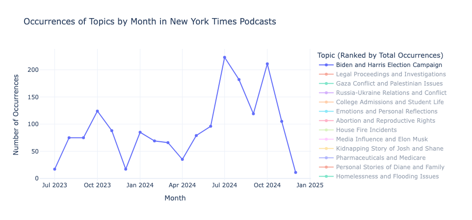
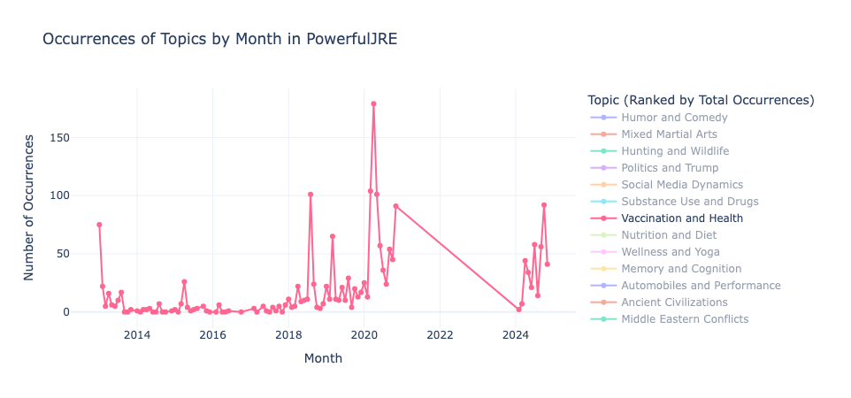
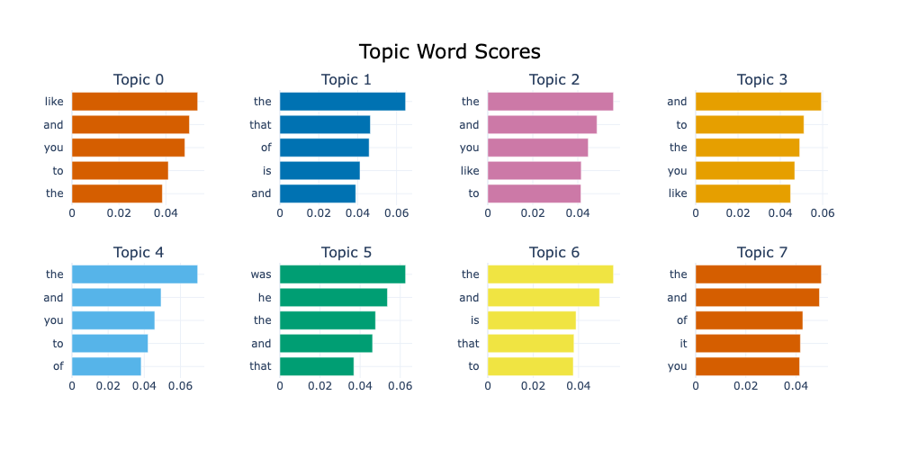
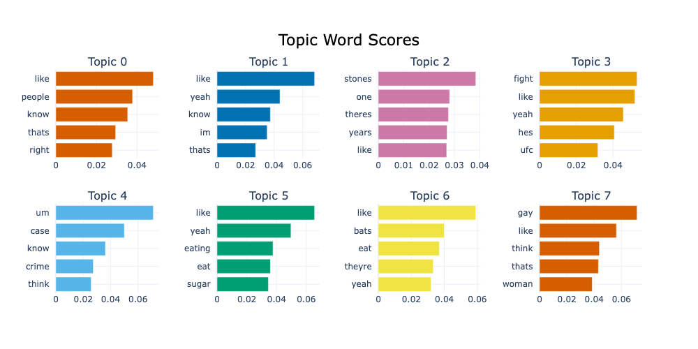
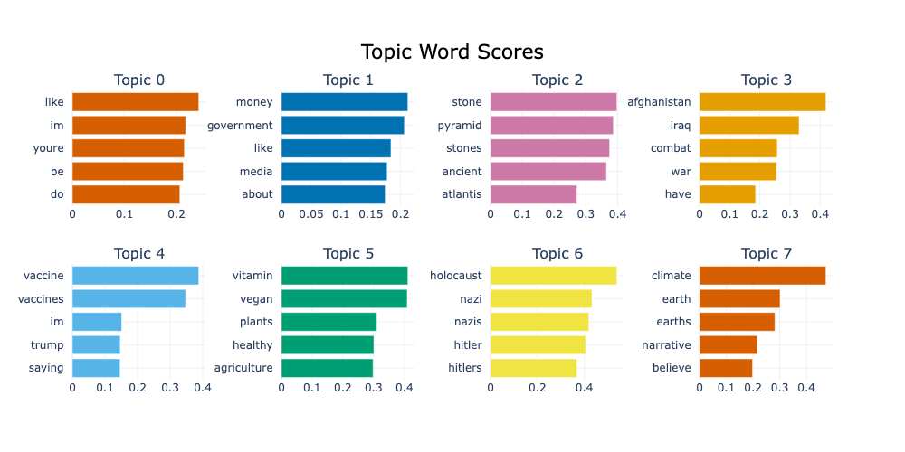

## CSE 256 Final Project Fall 2024: Analyzing Changing Trends of Podcasts Over Time Using BERTopic

**Author**: Connor Gag

**Email**: cgag@ucsd.edu  

---

### Introduction
- **Problem Definition**: Podcasts and YouTube videos are a popular way for people around the world to learn and be entertained, sometimes at the same time. The problem is how to objectively understand and quantify the content of each podcast. The topic modeling problem has been addressed for websites, but applying this to videos and audio is still not common. The goal is to use and fine-tune a topic-extraction model on podcasts. This can be used for bias detection, content filtering, recommendation systems, and other important needs.
  

- **Goals**:
  - Collect transcripts over time from popular podcasts: ✅
  - Record timestamps of each video: ✅
  - Split the data into batches for BERTopic to ingest: ✅
  - Generate most common topics for the podcast: ✅
  - Improve the topic model to address roadblocks with podcast transcriptions: ✅
  - Generate the number of topics for each timestamp: ✅
  - Graph each topic over time: ✅
  - Enhance topic labels using an LLM: ✅
  - Analyze time-series trends for different podcasts: ✅

---

### Related Work

There are many topic modeling methods to choose from. The most popular are LDA [2], NMF [8], Top2Vec [1], and BERTopic [5]. BERTopic and NMF are the most accurate and avoid overlap of ideas within the outputted topics.

We used BERTopic, which uses BERT and TF-IDF to cluster documents and retrieve the most prominent topics. We decided to use BERTopic because it generates new insights in its topic modeling, going further than just summarizing the words in the document. The topics outputted are more than the average of the word embeddings, indicating a more intelligent topic creation following the clustering process [4].

BERTopic is a popular choice when topic extraction is needed in the presence of large amounts of data. For example, BERTopic was used to identify and categorize dark website with the assistance of an internet crawler [7]. One notable difference in technique that we have implemented is our approach to the topic names. Sandlin et al. manually relabeled the topic outputs from BERTopic, which was cumbersome but lead to accurate classification of dark websites. We used GPT 4o because automating the process made it easier for a higher number of topics to be found. Manually checking the accuracy of GPT 4o for this task, it would have been difficult for humans to do a better job. 

One concern was whether or not BERTopic would be able to handle conversations as unstructured as those found in podcasts and YouTube videos. It has proven to be accurate on text from articles and websites, but podcasts contain actual speech and conversations, in some cases containing more stop words like 'um'. However, BERTopic also performs well on topic modeling on less structured text [3]. This study by Cheddak et al. shows BERTopic's effectiveness on notes obtained from brainstorming sessions [3].

Lastly, the idea of topic modeling over time is not new; this has been done on Twitter with NMF [6]. This can be used to track new topics and themes in society as they emerge. This approach is valuable, but limited to the one form of social media that is messages/forums. Podcasts and YouTube videos are valuable resources that deliver information to and influence millions of people every day, so summarizing their content is an important goal.

---

### Dataset
##### Description
Our dataset contains transcripts of podcasts from one channel. These podcasts are posted on YouTube and are conveniently stored in a YouTube playlist on the creator's channel. Our data also contains the timestamps for each YouTube video. The main difficulties with topic extraction for this dataset are the missing timestamps and the casual language used in the videos. As discussed above, podcast and YouTube videos are not always heavily edited, which can make the transcriptions messy. The solution to this will be covered more in the [Error Analysis Section](#error-analysis). The solution to the missing timestamps is covered in the [Preprocessing section](#data-preprocessing).

We ran the program on two podcasts: "PowerfulJRE" and "New York Times Podcasts".

| **Podcast Name**           | **Number of Videos** | **Number of Words** | **Chunks (200 words each)** |
|----------------------------|----------------------|---------------------|-----------------------------|
| **PowerfulJRE**             | 2,207                 | 45,687,800          | 228,439                     |
| **New York Times Podcasts** | 582                  | 2,091,000           | 10,455                      |

These podcasts were chosen because they are within the top five most popular podcasts, have YouTube videos for each episode (makes transcription easier), and have been around for at least one year (makes time series analysis more effective). It also allows us to compare results between more structured speech and casual conversation.

##### Example from the Podcast *PowerfulJRE*:

- **Transcript Chunk**: 
  "I was like Ali he's either gonna want to fight me but there's two against one fact he got he's up my brother..."
  
- **Extracted Topic**: `ufc_fights_fight_like`
  
- **Enhanced Topic Name**: `Mixed Martial Arts`

The data can be messy because podcasts are oftentimes conversations between two or more people. However, topics can still be extracted from the data.

##### Example from the Podcast *New York Times Podcasts*:

- **Transcript Chunk**:  
  "Over the last 30-40 years, things are basically going according to plan here. Problem is, these fires in Canada are showing us that..."
  
- **Extracted Topic**: `warming_climate_emissions_heat`
  
- **Enhanced Topic Name**: `Climate Change and Global Warming`

The audio transcriptions are much clearer in this podcast because it is a news podcast. There is one speaker at a time and the script is prepared beforehand. This makes it much easier for BERTopic to classify topics, as will be shown later.

### Data Preprocessing

We pulled the YouTube transcripts using youtube_transcript_api, which pulls the already created transcripts for the video. This means the data was not cleaned or preprocessed in any way before we extracted it. 

The first preprocessing change to the data was filling in missing dates for some of the videos. Older YouTube videos sometimes lacked timestamps when retrieved using pytube's API. This was likely a pytube issue and not a Youtube issue because Youtube videos always have the date they were posted. We fixed this issue by filling in the missing dates with the date exactly in between it's surrounding dates. This is a good estimate because the order of the videos is chronological and the surrounding videos are usually less than a week apart.

The second preprocessing step was to prepare the data for BERTopic. We split the data into chunks of 200 words each because BERTopic was trained on data in the form of sentences and paragraphs. We adjusted the batch size for different models, but found no significant difference when adjusting it between 100 words and 500 words. We decided on 200 words to allow for more topics to be found in each video without having too many batches.

### Data Annotation
No manual data annotation was done. We used GPT 4o to enhance the labels that BERTopic produced, but the resulting data and labels were not fed into another model, they were just used for analysis.

---

### Baselines
Our baseline model is BERTopic. Topic modeling has been used on text data in recent studies, but not on audio data.

The goal is to adapt this baseline model to our task, which is topic modeling within podcasts. The main parameters we adjusted from the baseline are the representation model and the batch size.

- We used BERTopic with KeyBERTInspired as our representation model to help prevent stopwords in the topic names. This library extracts keywords that are most relevant to all of the possible topics, making it clearer to BERTopic which words to pay attention to (more on this in [Error Analysis](#error-analysis)). This is the main hyperparameter that we adjusted after trying multiple other approaches. 

- We also adjusted the batch size in the preprocessing step, settling on a batch size of 200.

---

### Approach
- **Conceptual Approach**: 
  - Our approach is splitting the transcripts into batches while maintaining the timestamp of each batch. We then use BERTopic to generate the main topics of the dataset, and then to generate the main topic for each batch of words. This allows us to plot these topics over time. To make the results easier to read, we use GPT 4o to enhance the names of the topics.
  
- **Working Implementation**:
  - The working implementation is in the jupyter notebook BERTopic_Podcast_Topic_Modeling.ipynb. This notebook runs the whole program, from downloading the transcripts to generating the time-series graphs. The parameters of the model, such as the podcast, number of videos, batch size for transcripts, etc. can be adjusted at the top of the notebook. 

- **Compute Environment**:
  - We used a computer's local CPU for the project. A GPU would have been much quicker, but we bypassed this constraint by saving transcripts, timestamps, topics, and models locally to avoid repeated work.
 
- **Runtime**: 
  - Downloading the transcripts takes about 1-2 seconds per video, so in total it took about an hour to download all of the transcripts of a playlist.
  - Fitting the BERTopic model to the data takes about 30 minutes.
  - This data is stored after downloading it the first time, so running the program again takes less than a minute.
  
- **Results**:
  - Our results show that BERTopic performs well on more structured podcasts like "New York Times Podcasts" and worse on podcasts like "PowerfulJRE". However, the lower classification rate on conversational podcasts may be offset by the higher amount of videos outputted by these channels. 
  
  We can compare the classification rates of the two podcasts. This is the percent of the batches that the model was able to categorize within a topic. The other batches are not used. Because the "PowerfulJRE" podcast is more conversational, BERTopic had a more difficult time classifying many of the batches.

    - The classification rate of "New York Times Podcasts" is 78.56%.
    - The classification rate of "PowerfulJRE" is 37.98%.

- **Data Analysis Example**:

Topic modeling on podcasts can successfully show how topics increase and decrease in frequency depending on the time and the podcast. We can isolate certain topics to make this clear. 

The Biden and Harris election campaign was a popular topic for all news stations, including the New York Times. We can see a big dropoff of discussion after the election.

Vaccinations were a much larger topic of discussion in 2020 due to the COVID-19 pandemic. This pandemic is likely the reason that no videos were posted for about three years on "PowerfulJRE".

---

### Error Analysis

The main issue with the "PowerfulJRE" podcast is the high amount of stop words. This makes sense because podcasts tend to be very conversational. However, this presents a difficult challenge when extracting topics.

In order to analyze the topic extraction results, we manually looked at the top words in each topic, paying attention to the number of stop words in each topic.

1. First we tried running BERTopic without changing the data. This resulted in only stop words.
   

2. We then manually deleted stop words using stop words from NLTK. This did not help because new general/common words continued to appear in the topics. 

3. We then switched to KeyBERTInspired. Using this library significantly reduced the number of stop words in our topic names. KeyBERTInspired works by finding the documents in the dataset that are the most representative of each topic. It then creates an embedding for each topic using its corpus of representative documents. We can then extract the most important words out of each batch by computing the cosine similarity of the batch with the topic embedding. This approach proved to be the most effective.

---

### Conclusion
BERTopic and other topic classification tools are typically used on media like Twitter and online articles, but its use within media that is not originally text-based is much less common. The results found here are promising because they show that transcripts from audio can still be classified using BERTopic

The main roadblock to progress in this area is the difference between structured text and audio transcriptions. The amount of stop words, number of speakers, and errors from transcriptions all make BERTopic's job much more difficult. While the results for more conversational podcasts are worse than more structured audio, the classification proved to be good enough to analyze trends within the data. 
  
One way we could improve our results is by adding more features to the model. Our data only contains transcripts, which is text data. However, adding the actual videos associated with each episode, as well as other metadata (name of episode, guests on episode, etc.) could improve the topic modeling.

It is important to note that these findings are limited. In order to better understand approaches to topic modeling for podcasts, it is necessary to run this program on other podcasts. Another way to compute the accuracy of the computed topics would be to use annotated data. This would allow the fine-tuning of BERTopic hyperparameters before applying it to more tasks.

---

### Acknowledgements
- ChatGPT was used for idea brainstorming, code debugging, and Markdown syntax help. No major changes were made to the project content with the use of ChatGPT or AI.

---

### References

[1] Angelov, D. (2020). Top2Vec: Distributed Representations of Topics. ArXiv.  
&nbsp;&nbsp;&nbsp;&nbsp;&nbsp;https://arxiv.org/abs/2008.09470

[2] Blei, D. M., Ng, A. Y., & Jordan, M. I. (2003). Latent Dirichlet allocation. Journal of  
&nbsp;&nbsp;&nbsp;&nbsp;&nbsp;Machine Learning Research, 3, 993–1022.

[3] Cheddak, A., Ait Baha, T., El Hajji, M., & Baslam, M. (2024).BERTopic for Enhanced  
&nbsp;&nbsp;&nbsp;&nbsp;&nbsp;Idea Management and Topic Generation in Brainstorming Sessions. Information,  
&nbsp;&nbsp;&nbsp;&nbsp;&nbsp;15(6), 365. https://doi.org/10.3390/info15060365

[4] Egger, R., & Yu, J. (2022). A Topic Modeling Comparison Between LDA, NMF,  
&nbsp;&nbsp;&nbsp;&nbsp;&nbsp;Top2Vec, and BERTopic to Demystify Twitter Posts. Frontiers in Sociology, 7, 886498.  
&nbsp;&nbsp;&nbsp;&nbsp;&nbsp;https://doi.org/10.3389/fsoc.2022.886498

[5] Grootendorst, M. (2022). BERTopic: Neural topic modeling with a class-based TF-IDF  
&nbsp;&nbsp;&nbsp;&nbsp;&nbsp;procedure. ArXiv. https://arxiv.org/abs/2203.05794

[6] Saha, A., & Sindhwani, V. (2012). Learning evolving and emerging topics in social  
&nbsp;&nbsp;&nbsp;&nbsp;&nbsp;media: A dynamic NMF approach with temporal regularization. Proceedings of the  
&nbsp;&nbsp;&nbsp;&nbsp;&nbsp;fifth ACM international conference on Web search and data mining (WSDM '12),  
&nbsp;&nbsp;&nbsp;&nbsp;&nbsp;693–702. https://doi.org/10.1145/2124295.2124376

[7] Sandlin, H., Mármol, F. G., Bovet, G., & Pérez, G. M. (2024). A Big Data Architecture  
&nbsp;&nbsp;&nbsp;&nbsp;&nbsp;for Early Identification and Categorization of Dark Web Sites. ArXiv.  
&nbsp;&nbsp;&nbsp;&nbsp;&nbsp;https://arxiv.org/abs/2401.13320

[8] Wang, J., & Zhang, X. (2021). Deep NMF Topic Modeling. ArXiv.  
&nbsp;&nbsp;&nbsp;&nbsp;&nbsp;https://arxiv.org/abs/2102.12998
